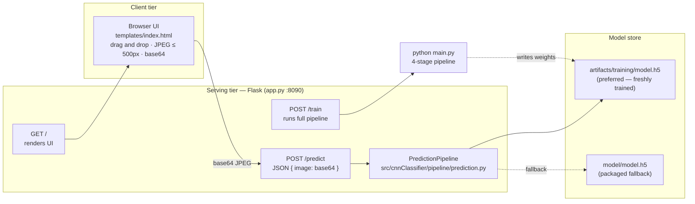
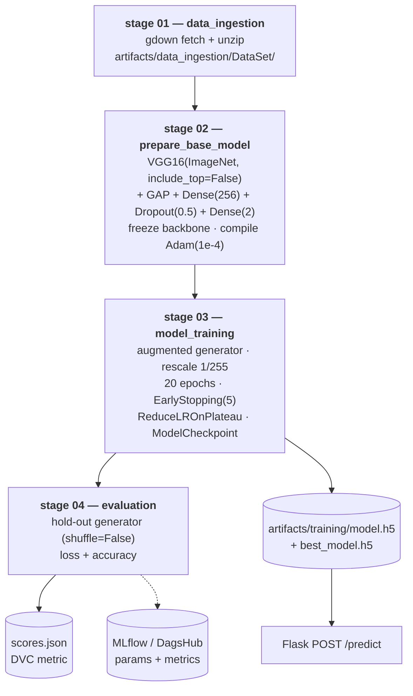
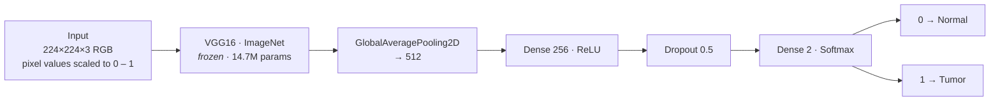

<div align="center">

# Kidney Disease Classification — Deep Learning Service

**Transfer-learning (VGG16) binary classifier for kidney CT scans · Reproducible ML pipeline (DVC) · Experiment tracking (MLflow / DagsHub) · REST inference service (Flask)**

[](https://github.com/SHARATH204-MAX/Kidney-Disease-Classification-DeepLearning/actions/workflows/main.yaml)
[](https://dvc.org)
[](https://mlflow.org)
[](https://www.tensorflow.org)
[](https://www.python.org)
[](https://flask.palletsprojects.com)

</div>

---

## Table of Contents

- [Overview](#overview)
- [Key Features](#key-features)
- [Architecture](#architecture)
  - [System / Serving Architecture](#1-system--serving-architecture)
  - [ML Training Pipeline](#2-ml-training-pipeline-dvc-stages)
  - [Model Architecture](#3-model-architecture)
  - [Preprocessing Contract](#4-preprocessing-contract--invariants)
- [Tech Stack](#tech-stack)
- [Project Structure](#project-structure)
- [Getting Started](#getting-started)
- [Running the Project](#running-the-project)
- [API Reference](#api-reference)
- [Configuration Reference](#configuration-reference)
- [Experiment Tracking & Versioning](#experiment-tracking--versioning)
- [Evaluation & Metrics](#evaluation--metrics)
- [Docker & CI/CD](#docker--cicd)
- [Performance & Hardware Notes](#performance--hardware-notes)
- [Troubleshooting — Known Pitfalls](#troubleshooting--known-pitfalls)
- [Roadmap](#roadmap)
- [Acknowledgments](#acknowledgments)
- [License](#license)

---

## Overview

This repository contains an end-to-end, production-oriented deep-learning service that classifies
kidney CT scan images as **`Normal`** or **`Tumor`**.

It is built as four independently reproducible pipeline stages orchestrated by **DVC**, a Flask
inference service with a browser UI, MLflow experiment tracking via DagsHub, and a GitHub Actions
workflow that builds a Docker image, pushes it to Amazon ECR and deploys it to a self-hosted EC2
runner.

| Item | Value |
|---|---|
| Task | Binary image classification (`Normal` / `Tumor`) |
| Backbone | VGG16 (ImageNet weights, frozen) + custom classification head |
| Dataset | 7,360 CT images — 5,077 `Normal`, 2,283 `Tumor`, 512×512 JPEG |
| Split | 80 / 20 stratified-by-folder → 5,889 train · 1,471 validation |
| Input tensor | `224 × 224 × 3`, RGB, float32 scaled to `[0, 1]` |
| Total params | 14,846,530 (131,842 trainable — only the head is trained) |
| Serving | Flask REST API + HTML UI on port `8090` (`8080` in Docker) |

> **Class balance warning.** The dataset is ~69% / 31%. A model that predicts `Normal` for every
> image already "scores" 69% accuracy. Always read accuracy alongside per-class recall — see
> [Evaluation & Metrics](#evaluation--metrics).

---

## Key Features

- **Reproducible pipeline** — `dvc repro` rebuilds data, base model, trained weights and metrics
  only when code/params/data change; `dvc.lock` pins every stage's hash.
- **Typed configuration layer** — YAML → `ConfigurationManager` → frozen `@dataclass` config
  entities; components never read YAML directly.
- **Clean layering** — `components` (business logic) → `pipeline` (stage entry points) →
  `main.py` / `app.py` (orchestration).
- **Training hygiene** — augmentation, EarlyStopping with weight restoration, ReduceLROnPlateau,
  best-model checkpointing on `val_accuracy`.
- **Consistent preprocessing** between training, evaluation and inference (the single most common
  source of silent accuracy loss — see [Troubleshooting](#troubleshooting--known-pitfalls)).
- **Experiment tracking** — MLflow runs (params + metrics) pushed to DagsHub; `scores.json`
  exposed as a DVC metric.
- **Containerized delivery** — Dockerfile + CI/CD to ECR → EC2.
- **Browser UI** — drag & drop upload, client-side preview, single-click analysis.

---

## Architecture

### 1. System / Serving Architecture



### 2. ML Training Pipeline (DVC stages)



**Artifacts produced per stage**

| Stage | Inputs | Outputs |
|---|---|---|
| `data_ingestion` | Google Drive archive (see `config/config.yaml`) | `artifacts/data_ingestion/DataSet/{Normal,Tumor}/` |
| `prepare_base_model` | `params.yaml` | `artifacts/prepare_base_model/base_model.h5`, `base_model_updated.h5` |
| `training` | base model + dataset | `artifacts/training/model.h5`, `best_model.h5` |
| `evaluation` | trained model + dataset | `scores.json` (+ optional MLflow run) |

### 3. Model Architecture



| Layer | Output shape | Params | Trainable |
|---|---|---:|---|
| `InputLayer` | `(None, 224, 224, 3)` | 0 | — |
| `VGG16` blocks 1–5 (`include_top=False`) | `(None, 7, 7, 512)` | 14,714,688 | ✗ frozen |
| `GlobalAveragePooling2D` | `(None, 512)` | 0 | — |
| `Dense(256, relu)` | `(None, 256)` | 131,328 | ✓ |
| `Dropout(0.5)` | `(None, 256)` | 0 | — |
| `Dense(2, softmax)` | `(None, 2)` | 514 | ✓ |
| **Total** | | **14,846,530** | **131,842 trainable** |

- **Loss:** categorical cross-entropy · **Optimizer:** Adam (`LEARNING_RATE: 0.0001`)
- **Augmentation:** rotation 20°, width/height shift 0.10, zoom 0.15, horizontal flip
- **Callbacks:** EarlyStopping(`val_loss`, patience 5, `restore_best_weights=True`),
  ReduceLROnPlateau(`val_loss`, factor 0.2, patience 2, `min_lr=1e-7`),
  ModelCheckpoint → `artifacts/training/best_model.h5` (max `val_accuracy`)

### 4. Preprocessing Contract — Invariants

These four rules must hold in **training, evaluation and inference simultaneously**. Breaking any
of them produces a model or service that looks runnable but predicts garbage.

1. **Pixel scaling** — `ImageDataGenerator(rescale=1./255)` during training ⇒ inference must do
   `np.array(img, dtype=np.float32) / 255.0`. Never feed raw `0–255` values.
2. **Geometry** — resize to `224 × 224` with **bilinear** interpolation (`interpolation="bilinear"`
   in the generator; `Image.BILINEAR` in `prediction.py`).
3. **Class indices** — `flow_from_directory` sorts folder names alphabetically ⇒
   **`Normal = 0`, `Tumor = 1`**. `argmax == 1` is reported as `Tumor`.
4. **Optimizer state** — a model loaded from legacy `.h5` must be loaded with `compile=False` and
   re-compiled before `fit()` (see [Troubleshooting](#troubleshooting--known-pitfalls)).

---

## Tech Stack

| Layer | Technology |
|---|---|
| Deep learning | TensorFlow / Keras, VGG16 (ImageNet transfer learning) |
| Data handling | `ImageDataGenerator`, NumPy, Pillow, OpenCV/gdown for ingestion |
| Orchestration | DVC pipelines (`dvc.yaml` + `dvc.lock`) |
| Experiment tracking | MLflow, DagsHub remote tracking |
| Serving | Flask, Flask-CORS, Jinja2 (`templates/index.html`) |
| Configuration | YAML (`config/config.yaml`, `params.yaml`) + `python-box`, `python-dotenv` |
| Packaging | `setuptools` (`setup.py`, `pip install -e .`) |
| Containerization | Docker (`python:3.8-slim-buster`) |
| CI/CD | GitHub Actions → Amazon ECR → EC2 self-hosted runner |

---

## Project Structure

```text
Kidney-Disease-Classification-DeepLearning/
│
├── app.py                          # Flask entry point — serving tier (/, /predict, /train)
├── main.py                         # Orchestrates the 4 pipeline stages end-to-end
├── params.yaml                     # Hyper-parameters (DVC-tracked): EPOCHS, LR, BATCH_SIZE…
├── Dockerfile                      # Container image: python:3.8-slim + requirements + app
├── requirements.txt                # Runtime dependencies
├── setup.py                        # Package definition (src/ layout, `pip install -e .`)
├── template.py                     # Scaffolding utility for new project files
├── scores.json                     # Latest evaluation metrics (DVC metric)
├── inputImage.jpg                  # Sample input for smoke-testing /predict
├── dvc.yaml                        # DVC pipeline definition (4 stages)
├── dvc.lock                        # Locked stage hashes + params for reproducibility
├── .dvcignore / .dvc/              # DVC repository metadata
├── .env                            # ⚠ secrets: MLflow/DagsHub credentials (git-ignored)
│
├── config/
│   └── config.yaml                 # Path configuration (roots, file locations, data source)
│
├── src/cnnClassifier/              # Application package
│   ├── constants/__init__.py       # CONFIG_FILE_PATH, PARAMS_FILE_PATH
│   ├── entity/config_entity.py     # Frozen dataclasses: DataIngestion/PrepareBaseModel/
│   │                               #   Training/Evaluation configs
│   ├── config/configuration.py     # ConfigurationManager — YAML → typed entities
│   ├── utils/common.py             # read_yaml, create_directories, save_json, encode/decode…
│   ├── components/                 # Business logic (one class per stage)
│   │   ├── data_ingestion.py       #   download · skip-if-exists · unzip
│   │   ├── prepair_base_model.py   #   VGG16 base + classification head + compile
│   │   ├── model_training.py       #   generators · callbacks · fit · save
│   │   └── model_evaluation_mlflow.py  # hold-out evaluation · scores.json · MLflow
│   └── pipeline/                   # Thin, importable stage wrappers
│       ├── stage_01_data_ingestion.py
│       ├── stage_02_prepair_base_model.py
│       ├── stage_03_model_training.py
│       ├── stage_04_model_evaluation.py
│       └── prediction.py           #   PredictionPipeline — load weights · preprocess · argmax
│
├── templates/
│   └── index.html                  # Single-page UI (upload · preview · results panel)
│
├── research/                       # Exploratory notebooks, one per stage
│   ├── 01_data_ingestion.ipynb
│   ├── 02_prepare_base_model.ipynb
│   ├── 03_model_tarining.ipynb
│   ├── 04_model_evaluation.ipynb
│   └── trials.ipynb
│
├── artifacts/                      # Pipeline outputs (git-ignored, DVC-tracked)
│   ├── data_ingestion/DataSet/     #   Normal/ (5,077) · Tumor/ (2,283)
│   ├── prepare_base_model/         #   base_model.h5 · base_model_updated.h5
│   └── training/                   #   model.h5 · best_model.h5
│
├── model/
│   └── model.h5                    # Packaged weights used as fallback by the service
│
├── logs/running_logs.log           # Structured application log (stages + HTTP requests)
├── mlruns/                         # Local MLflow run store
│
├── .github/workflows/main.yaml     # CI/CD: lint+test → build/push ECR → deploy
└── .gitignore                      # ignores .env, .venv, artifacts/*, *.log
```

**Layering rule:** `pipeline/*` never contains logic; it wires `ConfigurationManager` →
`components/*`. `components/*` never read YAML directly; they receive typed config entities.

---

## Getting Started

### Prerequisites

- Python **3.8+** (developed and CI-built on 3.8; tested on 3.10+)
- ~2 GB free RAM for inference, ~4 GB for training
- *(Optional)* AWS credentials for CI/CD, DagsHub token for MLflow logging
- *(Optional)* `dvc` for running the pipeline reproducibly

### 1. Clone

```bash
git clone https://github.com/SHARATH204-MAX/Kidney-Disease-Classification-DeepLearning.git
cd Kidney-Disease-Classification-DeepLearning
```

### 2. Create the environment

```bash
python -m venv .venv
# Windows
.venv\Scripts\activate
# macOS / Linux
source .venv/bin/activate
```

### 3. Install dependencies

```bash
pip install -r requirements.txt      # installs the package itself (-e .)
```

### 4. Configure secrets

Create a `.env` file in the repository root (git-ignored):

```dotenv
MLFLOW_TRACKING_URI=https://dagshub.com/<owner>/<repo>.mlflow
MLFLOW_TRACKING_USERNAME=<your-dagshub-username>
MLFLOW_TRACKING_PASSWORD=<your-dagshub-token>
```

> Stage 04 refuses to run without `MLFLOW_TRACKING_PASSWORD` (it rejects empty or `PASTE_*`
> placeholder values). MLflow logging itself is invoked from
> `stage_04_model_evaluation.py` — enable it by uncommenting `evaluation.log_into_mlflow()`.

### 5. Fetch the dataset (if `artifacts/` is empty)

Data ingestion is idempotent — it skips the download when
`artifacts/data_ingestion/data.zip` already exists:

```bash
python main.py            # runs all four stages (data → base model → train → evaluate)
# or just the first stage:
python src/cnnClassifier/pipeline/stage_01_data_ingestion.py
```

---

## Running the Project

### Serve the web application

```bash
python app.py
# → http://127.0.0.1:8090
```

Open the URL in a browser, drag a CT image onto the drop zone and click **Analyze Scan**.

### Run / retrain the full pipeline

```bash
python main.py            # data ingestion → prepare base model → training → evaluation
dvc repro                 # equivalent, but only re-runs changed stages
```

Retrain via the API (blocking — runs the whole pipeline before responding):

```bash
curl -X POST http://127.0.0.1:8090/train
```

> **Weights are loaded once at process start.** After any retrain, restart `app.py` so the service
> picks up the new `artifacts/training/model.h5`.

### Run a single stage

```bash
python src/cnnClassifier/pipeline/stage_02_prepair_base_model.py
python src/cnnClassifier/pipeline/stage_03_model_training.py
python src/cnnClassifier/pipeline/stage_04_model_evaluation.py
```

### Useful DVC commands

```bash
dvc repro            # run the pipeline
dvc dag              # print the stage DAG
dvc exp show         # compare experiments/params
dvc status           # show what is out of date
```

### Exploratory notebooks

```bash
jupyter notebook research/
```

---

## API Reference

### `GET /`

Renders the UI (`templates/index.html`).

### `POST /predict`

Classifies one image.

| | |
|---|---|
| **Content-Type** | `application/json` |
| **Body** | `{ "image": "<base64-encoded image bytes>" }` — **raw base64 only**; the UI strips any `data:image/...;base64,` prefix before sending |
| **Success** | `200` · `[{"image": "Normal"}]` or `[{"image": "Tumor"}]` |

```bash
# example
python - <<'PY'
import base64, json, urllib.request
b64 = base64.b64encode(open("inputImage.jpg", "rb").read()).decode()
req = urllib.request.Request(
    "http://127.0.0.1:8090/predict",
    data=json.dumps({"image": b64}).encode(),
    headers={"Content-Type": "application/json"},
)
print(urllib.request.urlopen(req).read().decode())
PY
```

> Server-side preprocessing is applied inside `predict_base64`: decode → `RGB` → resize
> `224×224` (bilinear) → `float32 / 255.0` → batch dimension → `argmax`.

### `GET|POST /train`

Runs `python main.py` synchronously and responds
`Training done successfully!` when the pipeline finishes. Requests block for the entire run —
for long trainings prefer `python main.py` in a terminal or `dvc repro`.

---

## Configuration Reference

### `params.yaml` — hyper-parameters (tracked by DVC)

| Key | Default | Meaning |
|---|---|---|
| `AUGMENTATION` | `True` | Enable random rotation/shift/zoom/flip on the training split |
| `IMAGE_SIZE` | `[224, 224, 3]` | Model input shape (VGG16 native resolution) |
| `BATCH_SIZE` | `16` | Mini-batch size (369 steps/epoch on 5,889 images) |
| `INCLUDE_TOP` | `False` | Drop the VGG16 classifier head |
| `EPOCHS` | `20` | Maximum epochs (EarlyStopping may stop sooner) |
| `CLASSES` | `2` | Output units (`Normal`, `Tumor`) |
| `WEIGHTS` | `imagenet` | Backbone initialization |
| `LEARNING_RATE` | `0.0001` | Adam learning rate |

### `config/config.yaml` — paths

| Key | Value |
|---|---|
| `artifacts_root` | `artifacts` |
| `data_ingestion.local_data_file` | `artifacts/data_ingestion/data.zip` |
| `data_ingestion.unzip_dir` | `artifacts/data_ingestion` |
| `prepare_base_model.base_model_path` | `artifacts/prepare_base_model/base_model.h5` |
| `prepare_base_model.updated_base_model_path` | `artifacts/prepare_base_model/base_model_updated.h5` |
| `training.trained_model_path` | `artifacts/training/model.h5` |

### Environment variables

| Variable | Purpose |
|---|---|
| `MLFLOW_TRACKING_URI` | MLflow backend (DagsHub by default) |
| `MLFLOW_TRACKING_USERNAME` | MLflow auth user |
| `MLFLOW_TRACKING_PASSWORD` | MLflow auth token — **required by stage 04** |
| `TF_ENABLE_ONEDNN_OPTS` | Set to `0` by `app.py` for deterministic inference |
| `CUDA_VISIBLE_DEVICES` | Set to `-1` by `app.py` (CPU-only serving) |

---

## Experiment Tracking & Versioning

**DVC** owns *data, models and metrics*:

- `dvc.yaml` declares the four stages and which params each depends on.
- `dvc.lock` freezes code/param/data hashes so a pipeline run is reproducible.
- `scores.json` is registered under `metrics:` and compared across runs with `dvc exp show`.

**MLflow / DagsHub** owns *experiment lineage*:

- every evaluation logs `all_params` from `params.yaml` plus `loss` and `accuracy`;
- artifacts (`model.h5`) are attached to the run;
- local copies live under `mlruns/`; remote runs appear in the DagsHub UI.

```bash
mlflow ui          # local tracking UI (defaults to ./mlruns)
```

---

## Evaluation & Metrics

The evaluation stage builds a **hold-out generator that mirrors training**:

```python
ImageDataGenerator(rescale=1./255, validation_split=0.20)
    .flow_from_directory(..., subset="validation", shuffle=False,
                         target_size=(224, 224), interpolation="bilinear")
```

- `shuffle=False` keeps predictions aligned with `generator.classes`.
- `validation_split=0.20` **must match training** — using a larger split would evaluate on images
  the model has already seen (leakage).

**Reading the numbers**

| Metric | Location | Notes |
|---|---|---|
| `loss`, `accuracy` | `scores.json` | Written by stage 04; DVC metric |
| `loss`, `accuracy` | MLflow run | Same values, plus full param set |
| Training curve | console / `logs/running_logs.log` | Per-epoch `loss`, `val_loss`, `val_accuracy` |

Because of the 69/31 class imbalance:

- treat **accuracy ≈ 0.69** as *"predicts `Normal` every time"* until proven otherwise;
- a healthy model should show both `accuracy` well above the class prior **and** a
  `val_loss` far below `ln(2) ≈ 0.693`;
- add per-class recall / confusion matrix reporting before trusting the model clinically
  (tracked in the [Roadmap](#roadmap)).

---

## Docker & CI/CD

### Build & run locally

```bash
docker build -t cnncls .
docker run -d -p 8080:8080 --name cnncls cnncls
```

### GitHub Actions (`.github/workflows/main.yaml`)

| Job | Runner | Purpose |
|---|---|---|
| `integration` | `ubuntu-latest` | Checkout → lint → unit tests *(placeholders)* |
| `build-and-push-ecr-image` | `ubuntu-latest` | Configure AWS → login ECR → `docker build` → push `:latest` |
| `Continuous-Deployment` | `self-hosted` | Pull image from ECR → `docker run -p 8080:8080` → prune stale images |

Required repository secrets:
`AWS_ACCESS_KEY_ID`, `AWS_SECRET_ACCESS_KEY`, `AWS_REGION`, `AWS_ECR_LOGIN_URI`,
`ECR_REPOSITORY_NAME`.

> **Port note:** `app.py` binds `8090` locally, while the workflow/Dockerfile target `8080`.
> Align `app.run(port=...)` with the container port mapping before deploying.

---

## Performance & Hardware Notes

- Training is the bottleneck: **≈ 8 s/step** on a 12-logical-core CPU-only machine
  (≈ 50–60 min/epoch at `BATCH_SIZE=16`), i.e. many hours for a full 20-epoch run.
- Inference is cheap: a single `predict` call takes well under a second after the model is loaded.
- Levers if you need speed: raise `BATCH_SIZE` (CPU is rarely saturated), enable GPU
  (`CUDA_VISIBLE_DEVICES`), lower `EPOCHS` for smoke tests, or run `dvc repro` so unchanged
  stages are skipped.
- Memory: ~2 GB RSS while training, ~0.7 GB while serving.

---

## Troubleshooting — Known Pitfalls

| Symptom | Root cause | Fix |
|---|---|---|
| Every prediction returns the same label; `scores.json` accuracy ≈ 0.69 | Training was run with `EPOCHS=1` / `LEARNING_RATE=0.01` — the head diverged (loss 10–15) and collapsed to the majority class | Train with the configured `EPOCHS: 20` / `LEARNING_RATE: 0.0001`, then verify `val_loss` drops below 0.693 |
| Predictions random/wrong although training accuracy looks fine | Inference feeds raw `0–255` pixels while training used `rescale=1./255` | Restore `np.array(img, dtype=np.float32) / 255.0` in `pipeline/prediction.py` |
| `ValueError: Unknown variable: <Variable path=dense/kernel …> — This optimizer can only be called for the variables it was originally built with` | Keras 3 legacy-`.h5` round-trip leaves the restored optimizer built with an empty variable set | `load_model(path, compile=False)` then call `model.compile(...)` with a fresh optimizer (`components/model_training.py`) |
| Evaluation accuracy higher than it should be | Eval `validation_split=0.30` vs training `0.20` ⇒ ~⅓ of evaluated images were trained on | Keep both splits identical (`0.20`) |
| Retrained but the app still predicts like before | Weights are loaded at process start; `model/model.h5` is a packaged copy | Restart `app.py`; `PredictionPipeline` now prefers `artifacts/training/model.h5` |
| `/train` request hangs for hours | The route runs the entire pipeline synchronously | Run `python main.py` / `dvc repro` in a background terminal |
| Stage 04 fails immediately | Missing/placeholder `MLFLOW_TRACKING_PASSWORD` | Fill in `.env` (see [Getting Started](#getting-started)) |
| Data stage tries to re-download | `artifacts/data_ingestion/data.zip` missing | Restore `artifacts/` or allow the download; the stage skips when the archive exists |

---

## Roadmap

- [ ] Per-class metrics: precision / recall / F1, confusion matrix and ROC-AUC in `scores.json`
- [ ] Class-weighted loss to counter the 69/31 imbalance
- [ ] Fine-tuning phase: unfreeze `block5_conv*` at `lr=1e-5` for a final accuracy push
- [ ] Migrate legacy `.h5` artefacts to the native `.keras` format
- [ ] Real unit/integration tests replacing the CI placeholders
- [ ] GPU-enabled training (CUDA) and batched prediction endpoint
- [ ] Model registry / promotion flow (staging → production) via MLflow
- [ ] Docker health-check endpoint and non-root container user
- [ ] Saliency / Grad-CAM overlays in the UI to make predictions explainable
- [ ] Add a `LICENSE` file

---

## Acknowledgments

- [VGG16](https://arxiv.org/abs/1409.1556) — Simonyan & Zisserman, ImageNet weights via Keras Applications
- [MLflow](https://mlflow.org/) · [DagsHub](https://dagshub.com/) · [DVC](https://dvc.org/)
- [TensorFlow / Keras](https://www.tensorflow.org/) · [Flask](https://flask.palletsprojects.com/)

---

## License

No license file has been added to this repository yet. All rights are reserved by the author by
default — add an open-source `LICENSE` (e.g. MIT) if you intend to distribute the project.
